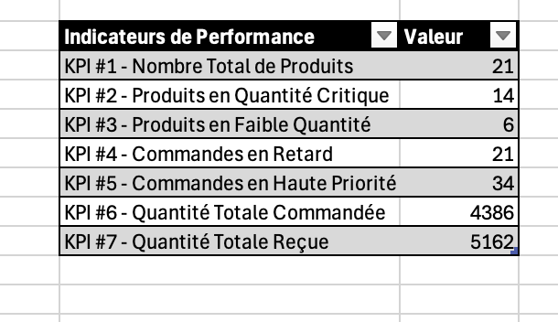
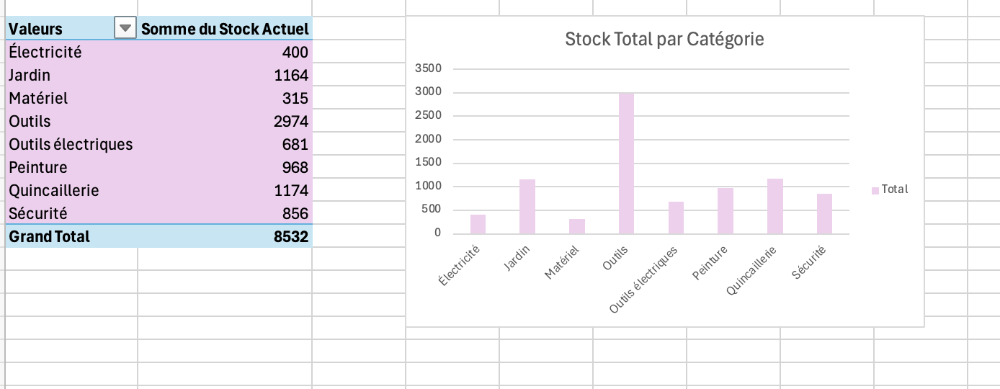
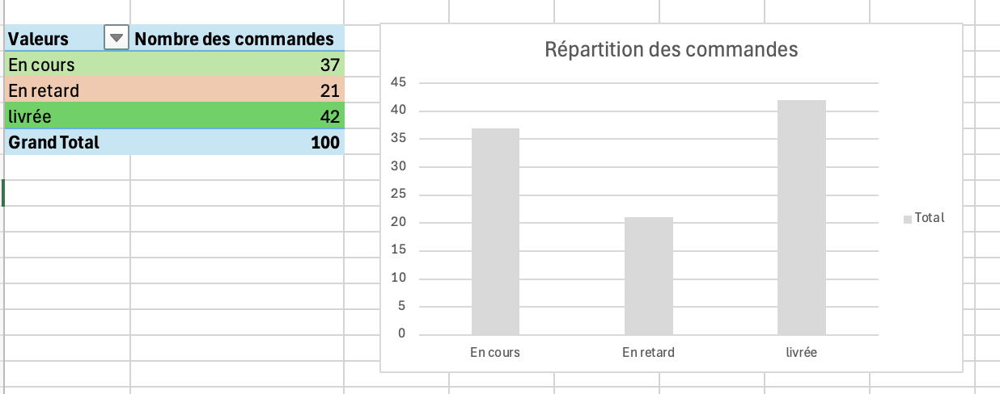
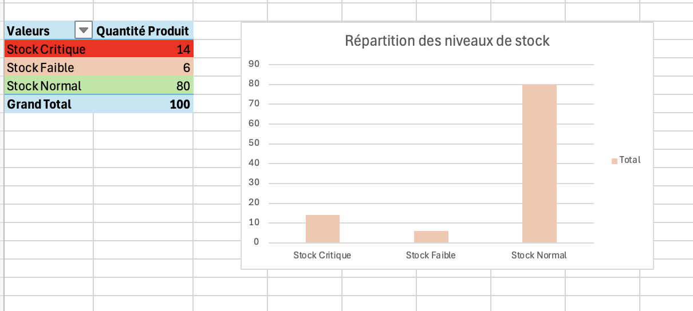

# Supply-Chain-Inventory-Operational-Reporting-Dashboard

This project simulates a distribution center reporting workflow using Microsoft Excel and Power Query.
The goal of this project is to monitor inventory levels, customer orders, product receptions, stock risks, late orders, and operational priorities through an Excel dashboard.

## Tools Used

- Microsoft Excel

- Power Query

- Pivot Tables

- CSV Data Sources

## Features

- Imported, cleaned, merged, and transformed inventory, order, and reception data using Power Query;

- Created Key Performance Indicators (KPIs) related to stock levels, late orders, high-priority orders, and received quantities;

- Built pivot tables and charts to analyze inventory status, order status, and operational trends;

- Developed an operational dashboard to improve data visibility and support decision-making in a simulated supply chain environment.

### Operational Dashboard

### Inventory Analysis by Category

### Order Status Analysis

### Inventory Status Analysis

### Power Query Data Transformation

# Disclaimer

This project was created for educational, learning, and portfolio demonstration purposes only.

The inventory, order, and reception datasets used in this project are simulated and were designed to represent a simplified supply chain and distribution environment. The data does not reflect any real company, customer, product, or operational process.

